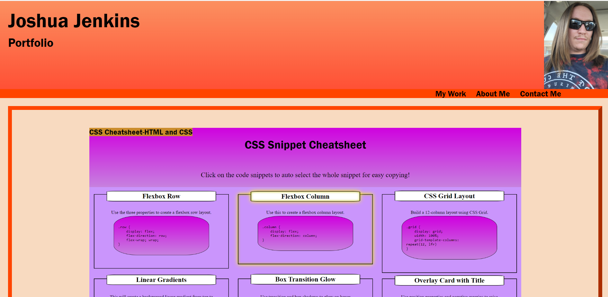

# Portfolio

## Description

This is the second weekly challenge assigned to me by the Washington University Coding Boot Camp. The challenge was to create a professional portfolio from scratch that we should plan on adding to throughout the course and our career and actually using in our professional lives outside of class.

For this assignment, we were told to create our portfolio with a header and footer, a nav section with working links, a main section with titled images that act as links with the first one being bigger than the rest, and for the elements of the page to change layout to look better on smaller screens.

Through working on this assignment, I learned more about working with CSS; I learned about using flexbox, developed a better understanding of how to use positioning with different content and containers, and got some practice designing a page completely from scratch.

## Installation

N/A, it's a webpage.

## Usage

The webpage can be found [here](https://wolfspiderman.github.io/Portfolio/)

The navigation links at the top right under the picture, on computer, or in the middle at the top of the page, on mobile, will direct the user to the corresponding sections of the page. The images that are not placeholder images will direct the user to the webpage displayed in the image, while the placeholder images will direct the user back to the top for now. The links in the contact section are currently all placeholder links that direct to the top, except for the github link which directs the user to my github page.

The following is a screenshot of what the top of the page looks like on a computer moniter.

## Credits

I was given the starter code for this project by Washington Univerity St.Louis Coding Bootcamp.

For this project I utilzed the Axe Devtools Chrome extension to check the accessibilty of the webpage as I worked on it.

I used the following webpages, recommended to us by WUSTL, to guide me in creating the CSS Snippet Cheatsheet page.

[CSS linear-gradient function](https://developer.mozilla.org/en-US/docs/Web/CSS/linear-gradient)

[CSS user-select property](https://developer.mozilla.org/en-US/docs/Web/CSS/user-select)

[HTML pre element](https://developer.mozilla.org/en-US/docs/Web/HTML/Element/pre)

I also used the following to help guide me in using flexbox

[Flexbox Froggy](https://flexboxfroggy.com/)

## License

Licensed under the MIT License
